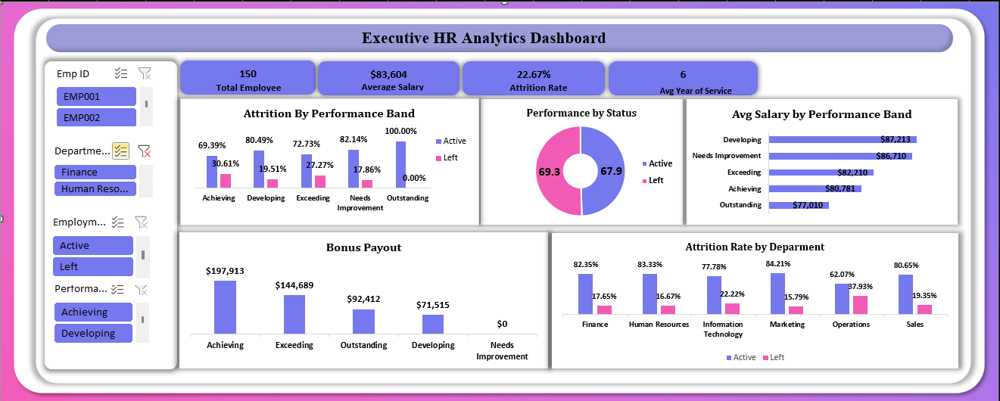

# HR-Analytics-Executive-Dashboard
An interactive HR Analytics Dashboard built in Excel, featuring data cleaning, transformation, and executive-level retention insights.

# Data Cleaning & Transformation Documentation

**1. Initial Data Exploration & Observations**

After loading the HR dataset into Excel, I carried out an initial review to understand its structure and identify any data quality issues before beginning the analysis.

**Dataset Structure**

The dataset contains employee records with information on demographics, job details, performance, compensation, and employment status.

**Initial Observations**

a. Some text fields contained unnecessary trailing spaces.

b. Date values were not consistently formatted across the dataset.

c. A few important columns contained missing values that needed to be handled carefully to preserve the integrity of the data.

**2. Data Quality Issues Identified**

During the initial data audit, I identified the following issues:

a. Missing Employee First Names: Some records did not contain employee first names, making those records difficult to identify.

b. Incorrect Formula References: A few lookup and calculation formulas initially referenced the wrong cells, resulting in inaccurate outputs that needed to be corrected.

c. Chart Axis Formatting: The Years of Service field was stored as a number, causing Excel charts to display plain integers instead of more descriptive labels.

# Data Cleaning & Transformation Process

**Step 1: Removing Duplicate Records**

**Decision**

I checked the entire dataset for duplicate records and removed all identical rows before performing any calculations or analysis.

**Reason**

Removing duplicates ensures that employee counts, salary totals, averages, and other calculations are based only on unique employee records. This prevents duplicate entries from affecting the accuracy of the analysis.

**Step 2: Creating the Full Name Column**

**Decision**

I combined the First Name and Last Name columns into a single Full Name column using an IF-based formula with ISBLANK, PROPER, TRIM, and TEXTJOIN functions. The formula also accounted for records with missing first names by displaying a "-" in place of the missing value.

**Reason**

Creating a single Full Name column provides a consistent way to identify employees across the dataset. Using TRIM removed any unnecessary spaces, PROPER standardised the text formatting, and the conditional logic ensured that records with missing first names were still displayed clearly instead of producing blank or incorrectly formatted names.

**Step 3: Standardising Text Format**

**Decision**

I applied the PROPER function to text fields such as employee names, departments, and job roles.

**Reason**

The raw data contained inconsistent text formatting, including uppercase, lowercase, and mixed-case entries. Using the PROPER function standardised the text by capitalising the first letter of each word, making the dataset more consistent and easier to read.

**Step 4: Categorising Data and Mapping Information**

**Decision**

I used the SWITCH function to assign standardised category values based on specific conditions. I also used XLOOKUP throughout the project to retrieve and map related employee information across reference tables.

**Reason**

The SWITCH function simplified conditional logic and made formulas easier to maintain. XLOOKUP was chosen because it performs exact matches by default, supports lookups in any direction, and continues to work even if columns are added or removed from the dataset.

**Step 5: Handling Missing Numerical Values**

**Decision**

Missing values in the Performance Score and Salary columns were replaced using the median value for each column.

**Reason**

Replacing missing values allowed all employee records to be retained for analysis. The median was chosen instead of the average because salary and performance data can be affected by extreme values. Using the median provides a better representation of the typical employee.

**Step 6: Calculating Eligible Bonus Amount**

**Decision**

I created a calculated column to determine each employee's eligible bonus amount based on their salary and the bonus percentage assigned to their performance rating.

**Reason**

This calculation converted the raw salary and performance data into a meaningful financial metric, making it possible to analyse and visualise bonus payouts across different performance levels.

**Step 7: Handling Missing First Names**

**Decision**

Some employee records had missing first names. Instead of deleting these records or filling the missing values with random names, I replaced each missing first name with a "-".

**Reason**

Using "-" clearly indicates that the first name is missing while preserving the integrity of the dataset. This approach keeps all employee records intact and makes it easy for anyone reviewing the data to identify records with missing first-name information.

# Executive Insights & Key Findings

The organization has a total workforce of **150 employees**, with **116 active employees** and **34 employees who have exited** the organization. This results in an overall **attrition rate of 22.67%**

The workforce has an **average salary of 83,603.94**, suggesting a competitive compensation structure across the organization. However, salary alone does not appear to be sufficient to retain employees, as the attrition rate remains relatively high.

Employees have an **average tenure of approximately 6years**, indicating that the organization retains a relatively experienced workforce. 

Departmental analysis reveals significant differences in employee retention. The **Operations department records the highest attrition rate at 37.93%**, making it the department most affected by employee turnover. This suggests potential challenges related to workload, job satisfaction, management practices, or career progression that should be investigated.

The **Information Technology department** has an attrition rate of **22.22%**, which is consistent with the overall organizational average. Given the competitive nature of the technology labor market, targeted retention strategies may be beneficial.

On the other hand, **Human Resources (16.67%)**, **Marketing (15.79%)**, and **Finance (17.65%)** demonstrate comparatively lower attrition rates, indicating stronger employee stability within these departments.

Compensation also varies across departments. **Finance** has the highest average salary, while **Operations** has one of the lowest average salaries alongside the highest attrition rate. This relationship may suggest that compensation could be contributing to turnover within Operations.

Overall, the analysis indicates that the organization should prioritize employee retention initiatives, particularly within the Operations department. Conducting exit interviews, reviewing compensation and benefits, strengthening employee engagement programs, and providing clearer career development opportunities could help reduce turnover and improve workforce stability.

# Recommendations

Based on the findings from the HR analytics report, the following recommendations are proposed to improve employee retention, strengthen workforce stability, and support organizational performance:

1. **Prioritize Retention in the Operations Department:**
   The Operations department has the highest attrition rate (37.93%), making it the most critical area for intervention. Management should conduct employee surveys, stay interviews, and exit interviews to identify the underlying causes of turnover and implement targeted retention strategies.

2. **Review Compensation and Benefits:**
   Although the organization offers a competitive average salary, departments with relatively lower salaries and higher attrition should be assessed to ensure employees are fairly compensated. Benchmarking salaries against industry standards and introducing performance-based incentives may help improve employee retention.

3. **Strengthen Career Development Opportunities:**
   Employees are more likely to remain with an organization when they see opportunities for growth. Establishing structured career progression plans, mentorship programs, leadership development initiatives, and regular training can improve employee engagement and reduce voluntary turnover.

4. **Enhance Employee Engagement and Well-being:**
   Regular employee engagement surveys should be conducted to monitor job satisfaction and identify workplace concerns early. Promoting work-life balance, recognizing employee achievements, and supporting employee well-being can foster a more positive work environment.

5. **Improve Performance and Talent Management:**
   Managers should conduct regular performance reviews, provide constructive feedback, and create personalized development plans. Recognizing high-performing employees and providing clear career pathways can increase motivation and reduce the likelihood of employee exits.

6. **Monitor Attrition Trends Regularly:**
   HR should develop an interactive dashboard to track key workforce metrics such as attrition rate, headcount, average tenure, and employee demographics. Regular monitoring will enable management to identify emerging trends and make proactive, data-driven decisions.

7. **Conduct Workforce Planning and Succession Planning:**
   Identifying critical roles and preparing successors for key positions will reduce operational disruptions caused by employee departures. Effective workforce planning also helps ensure the organization has the right talent to meet future business needs.

8. **Promote a Positive Organizational Culture:**
   Building an inclusive, supportive, and collaborative workplace culture can significantly improve employee satisfaction and loyalty. Encouraging open communication, recognizing employee contributions, and providing supportive leadership can strengthen employee commitment to the organization.

## Conclusion

The HR analytics findings indicate that while the organization has a stable and experienced workforce, the overall attrition rate of 22.67% presents an opportunity for improvement. By focusing on employee retention, particularly within the Operations department, investing in employee development, enhancing engagement initiatives, and continuously monitoring workforce metrics, the organization can reduce turnover, improve employee satisfaction, and strengthen long-term organizational performance.

## 📂 Project Files & Access

To interact with the live charts, dynamic slicers, and KPI cards shown above, you can download the working dataset directly:

**Excel Workbook:** [Download HR_Analytics_Executive_Dashboard.xlsx](HR_Analytics_Capstone_Completed_(Aleemat_Agboola).xlsx)
  

